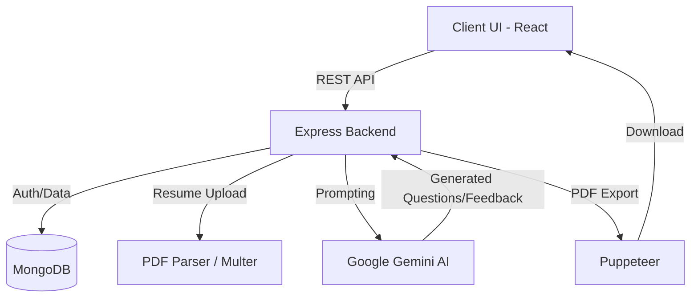

# 🚀 AI Job Preparation Platform

<div align="center">
  
  
  
</div>

<br />

## 📖 1. Short Project Description
An intelligent, full-stack AI Job Preparation Platform designed to help candidates ace their interviews. It features AI-driven, resume parsing, and detailed performance reports. By leveraging generative AI, this platform simulates real-world interview scenarios and provides constructive feedback.

## 🎯 2. Problem Statement
Job seekers often lack access to realistic, tailored mock interviews and actionable feedback. Traditional preparation methods are generic and fail to adapt to a candidate's specific industry, role, or resume. This platform solves this by offering personalized, AI-powered mock interviews that dynamically adjust based on the user's profile and performance.

## ✨ 3. Features
- **📄 Resume Parsing:** Extracts key skills and experience from uploaded resumes (PDF) to tailor questions.
- **📊 Comprehensive Reports:** Generates detailed feedback reports with performance metrics and areas for improvement.
- **🔒 Secure Authentication:** JWT-based secure user registration and login.
- **📥 PDF Downloads:** Export your interview reports as professionally formatted PDFs.
- **🌙 Dark Mode UI:** Premium, modern, and accessible user interface built with Sass.
- **🗂️ History Dashboard:** Track past interviews and monitor progress over time.

## 🛠️ 4. Tech Stack

### Frontend
- 
- 
- 

### Backend
- 
- 
- 

### AI & Utilities
- **Google Generative AI (Gemini):** For conversational AI and question generation.
- **Puppeteer & PDF-Parse:** For rendering dashboards to PDF and parsing resume documents.
- **JWT & Bcrypt:** For secure authorization and password hashing.
- **Zod:** For robust schema validation.

## 🏗️ 5. System Architecture / Workflow



## ⚙️ 6. How the Application Works (Step-by-Step)
1. **Onboarding:** User creates an account and logs in securely.
2. **Setup Profile:** User uploads their resume (PDF). The backend parses it to extract skills and experience.
3. **Initiate Interview:** User selects a target role. The system calls the Gemini AI with context from the resume to generate relevant questions.
4. **Mock Interview:** The user answers questions interactively.
5. **Evaluation:** AI evaluates the responses and compiles a detailed feedback report.
6. **Review & Export:** User views the report on their dashboard and can download it as a PDF for offline review.

## 🧠 7. AI Features Used
- **Contextual Question Generation:** Uses the candidate's parsed resume to dynamically create hyper-relevant interview questions.
- **Response Analysis:** Evaluates the candidate's answers for clarity, technical accuracy, and completeness.
- **Actionable Feedback:** Generates specific, constructive feedback and suggested improvements for each answer.

## 🔐 8. Authentication & Security Features
- **JWT (JSON Web Tokens):** For stateless, secure session management.
- **Bcrypt Password Hashing:** Ensures passwords are never stored in plain text.
- **Route Protection:** Frontend and Backend routes are protected; only authenticated users can access interview features and history.

## 📡 9. API Endpoints
| Method | Endpoint | Description |
| :--- | :--- | :--- |
| `POST` | `/api/auth/register` | Register a new user |
| `POST` | `/api/auth/login` | Authenticate user & get token |
| `POST` | `/api/interview/start` | Initialize a new interview session |
| `POST` | `/api/interview/upload-resume`| Upload & parse resume PDF |
| `GET`  | `/api/interview/history` | Fetch past interview reports |
| `GET`  | `/api/interview/report/:id` | Fetch specific report details |
| `GET`  | `/api/interview/download/:id` | Generate & download PDF report |

## 📂 10. Folder Structure
```text
ai-job-prep-platform/
│
├── Backend/
│   ├── src/
│   │   ├── controllers/      # Route handlers
│   │   ├── middlewares/      # Auth, Error handling, Uploads
│   │   ├── models/           # Mongoose schemas
│   │   ├── routes/           # API routing
│   │   └── services/         # AI integration, PDF generation
│   ├── .env                  # Backend Secrets (Ignored)
│   ├── server.js             # Entry point
│   └── package.json
│
├── Frontend/
│   ├── public/
│   ├── src/
│   │   ├── features/         # Domain-driven feature modules (Auth, Interview)
│   │   │   ├── auth/
│   │   │   └── interview/
│   │   ├── components/       # Reusable UI components
│   │   ├── utils/            # Helper functions
│   │   ├── App.jsx           # Main React component
│   │   └── main.jsx          # React DOM render
│   ├── .env                  # Frontend Variables (Ignored)
│   └── vite.config.js
│
└── .gitignore                # Root gitignore
```

## 🚀 11. Installation & Setup Instructions

### Prerequisites
- Node.js (v18+ recommended)
- MongoDB (Local or Atlas URL)
- Google Gemini API Key

### Steps
1. **Clone the repository:**
   ```bash
   git clone https://github.com/yourusername/ai-job-prep-platform.git
   cd ai-job-prep-platform
   ```
2. **Setup Backend:**
   ```bash
   cd Backend
   npm install
   ```
3. **Setup Frontend:**
   ```bash
   cd Frontend
   npm install
   ```
4. **Run the Application:**
   Open two terminals:
   - Terminal 1 (Backend): `cd Backend && npm run dev`
   - Terminal 2 (Frontend): `cd Frontend && npm run dev`

## 🔑 12. Environment Variables Required

**Backend (`Backend/.env`)**
```env
PORT=5000
MONGODB_URI=your_mongodb_connection_string
JWT_SECRET=your_super_secret_jwt_key
GEMINI_API_KEY=your_google_gemini_api_key
```

**Frontend (`Frontend/.env`)**
```env
VITE_API_BASE_URL=http://localhost:5000/api
```


Distributed under the MIT License. See `LICENSE` for more information.
